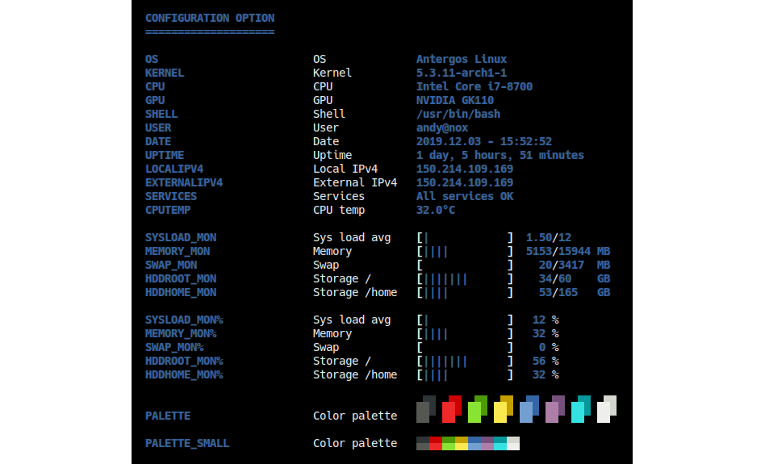

**synth-shell-status** shows a summary of your system's current health.
- Automatically printed in new terminal sessions (local, SSH, ...).
- Monitor your servers, RaspberryPis, and workstations. All system info you
    need at a glance (e.g. external IP address, CPU temperature, etc.).
- Detect broken services or CPU hogs.
- Print your own ASCII logo every time you log in.


<br/><br/>


<!--------------------------------------+-------------------------------------->
#                                     Setup
<!--------------------------------------+-------------------------------------->

### Automatic setup

The included [setup script](setup.sh) will guide you step by step through the
process and let you choose what features to install. During this setup, you can
choose to install synth-shell for your user only (recommended) or system-wide
(superuser privileges required). To proceed,
[open and play this link in a separate tab](https://www.youtube.com/embed/MpN91wHAr1k)
and enter the following into your terminal:
```
git clone --recursive https://github.com/andresgongora/synth-shell.git
chmod +x synth-shell/setup.sh
synth-shell/setup.sh
```

Note that for `fancy-bash-prompt.sh` you might also need
[power-line fonts](https://github.com/powerline/fonts). You can instal it
as follows (the exact name of the package varies from distro to distro):

* ArchLinux: `sudo pacman -S powerline-fonts`
* Debian/Ubuntu: `sudo apt install fonts-powerline`

Finally, open up a new terminal and test that everything works. Sometimes,
despite power-line fonts being properly installed, the triangle separator 
for `fancy-bash-prompt.sh` (if installed) might still not show. In this case, 
make sure that your `locale` is set to UTF-8 by editing `/etc/locale.conf` file 
(select your language but in UTF-8 format) and running `sudo locale-gen`.
[More info on locale](https://wiki.archlinux.org/index.php/locale).
Alternatively, try a different font in your terminal emulator. Some fonts
do not support special characters. We get the best results with
[hack-ttf](https://sourcefoundry.org/hack/).


### Configuration/customization
You can configure your scripts by modifying the corresponding configuration
files. You can find them, along example configuration files, in the following
folders depending on how you installed **synth-shell**:

* Current-user only: `~/.config/synth-shell/`
* System wide: `/etc/synth-shell/`


### Uninstallation
Run the setup script again (like during the installation), but choose 
`uninstall` when prompted.


<br/><br/>


<!--------------------------------------+-------------------------------------->
#                                    Overview
<!--------------------------------------+-------------------------------------->

`status.sh` provides a summarized system report at a single glance every time
you open up a new terminal. If it detects that any system parameter
(e.g. CPU load, memory, etc.) is over a critical threshold, it will provide a
warning and additional information about the cause. Last but not least, it
prints a user-configurable ASCII logo to impress your crush from the library
with how awesome you are.

Feel free to customize your status report through the many available options
in `~/.config/synth-shell/status.config` (user-only install) or
`/etc/synth-shell/status.config` (system-wide install),or by replacing their
content with the examples files you can find under the same directory.




<br/><br/>


<!--------------------------------------+-------------------------------------->
#                                   Contribute
<!--------------------------------------+-------------------------------------->

This project is only possible thanks to the effort and passion of many, 
including developers, testers, and of course, our beloved coffee machine.
You can find a detailed list of everyone involved in the development
in [AUTHORS.md](AUTHORS.md). Thanks to all of you!

If you like this project and want to contribute, you are most welcome to do so.


### Help us improve

* [Report a bug](https://github.com/andresgongora/synth-shell/issues/new/choose): 
  if you notice that something is not right, tell us. We'll try to fix it ASAP.
* Suggest an idea you would like to see in the next release: send us
  and email or open an [issue](https://github.com/andresgongora/synth-shell/issues)!
* Become a developer: fork this repo and become an active developer!
  Take a look at the [issues](https://github.com/andresgongora/synth-shell/issues)
  for suggestions of where to start. Also, take a look at our 
  [coding style](coding_style.md).
* Spread the word: telling your friends is the fastes way to get this code to
  the people who might enjoy it!


### Git branches

There are two branches in this repository:

* **master**: this is the main branch, and thus contains fully functional 
  scripts. When you want to use the scripts as a _user_, 
  this is the branch you want to clone or download.
* **develop**: this branch contains all the new features and most recent 
  contributions. It is always _stable_, in the sense that you can use it
  without major inconveniences. 
  However, it's very prone to undetected bugs and it might be subject to major
  unannounced changes. If you want to contribute, this is the branch 
  you should pull-request to.


<br/><br/>


<!--------------------------------------+-------------------------------------->
#                                     About
<!--------------------------------------+-------------------------------------->

**synth-shell-status** is part of
[synth-shell](https://github.com/andresgongora/synth-shell)


<br/><br/>


<!--------------------------------------+-------------------------------------->
#                                    License
<!--------------------------------------+-------------------------------------->

Copyright (c) 2014-2020, Andres Gongora - www.andresgongora.com

* This software is released under a GPLv3 license.
  Read [license-GPLv3.txt](LICENSE),
  or if not present, <http://www.gnu.org/licenses/>.
* If you need a closed-source version of this software
  for commercial purposes, please contact the [authors](AUTHORS.md).

